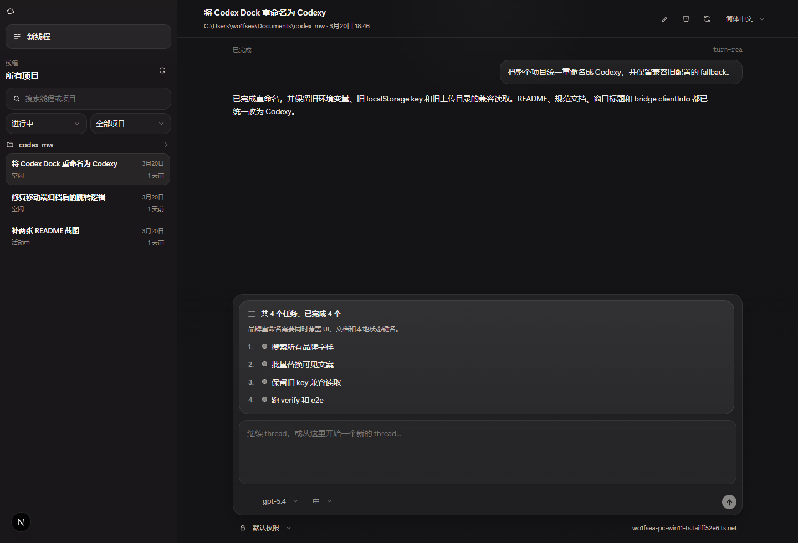
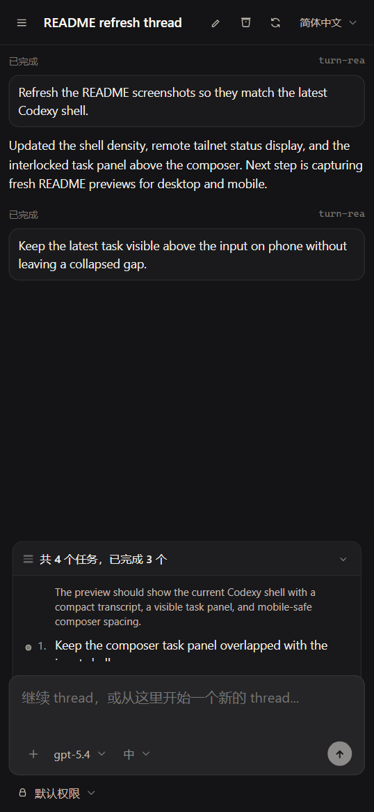

# Codexy

Codexy is a web control console for a Codex host. It provides thread lists, thread reading, continued conversations, image input, live output streaming, and approval handling.

The runtime in this repository is built on Next.js and listens on `0.0.0.0:3000` by default. It is intended to run on the host machine and then be exposed to other devices through Tailscale.

## Interface Preview

<table>
  <tr>
    <td valign="top" width="68%">
      <strong>Desktop</strong><br />
      
    </td>
    <td valign="top" width="32%">
      <strong>Mobile</strong><br />
      
    </td>
  </tr>
</table>

## Requirements

- Node.js 20+
- npm 10+

## Install Dependencies

```bash
npm install
```

## Entrypoints

### 1. Build

Build the production bundle:

```bash
npm run build
```

This writes the production bundle to `.next-runtime` so development runs can keep using `.next` without clobbering the live runtime.

Windows shortcut:

```bat
build.cmd
```

### 2. Development Runtime

Start the development server on port `3001` by default:

```bash
npm run dev
```

Windows shortcut:

```bat
dev.cmd
```

Shell shortcut:

```sh
./dev.sh
```

To use a custom port, pass the port directly or use `--port`:

```bat
dev.cmd 3100
dev.cmd --port 3100
```

### 3. Production Runtime

Build first, then start the production server:

```bash
npm run build
npm run start
```

Windows shortcut:

```bat
start.cmd
```

Shell shortcuts:

```sh
./build.sh
./start.sh
```

Custom ports are also supported:

```bat
start.cmd 3100
start.cmd --port 3100
```

```sh
./start.sh 3100
./start.sh --port 3100
```

## Default Port Split

- Production runtime: `3000`
- Development runtime: `3001`
- Direct entrypoints:
  - Windows: `build.cmd`, `dev.cmd`, `start.cmd`
  - Shell: `build.sh`, `dev.sh`, `start.sh`

## Common Verification Commands

Baseline verification:

```bash
npm run verify
```

Verification including end-to-end tests:

```bash
npm run verify:e2e
```

## Project Notes

- The web client talks to the server only through HTTP APIs and the event stream.
- The Codexy API Server connects to the Codex bridge and exposes stable browser-facing interfaces.
- Live execution and approval flows must go through the Codex protocol, not ad hoc shell wrappers.
- Engineering rules for orthogonality, simplicity, and context discipline live in [docs/engineering-governance.md](./docs/engineering-governance.md).

For detailed runtime ownership boundaries, see [agents.md](./agents.md). For product requirements, see [spec.md](./spec.md).
