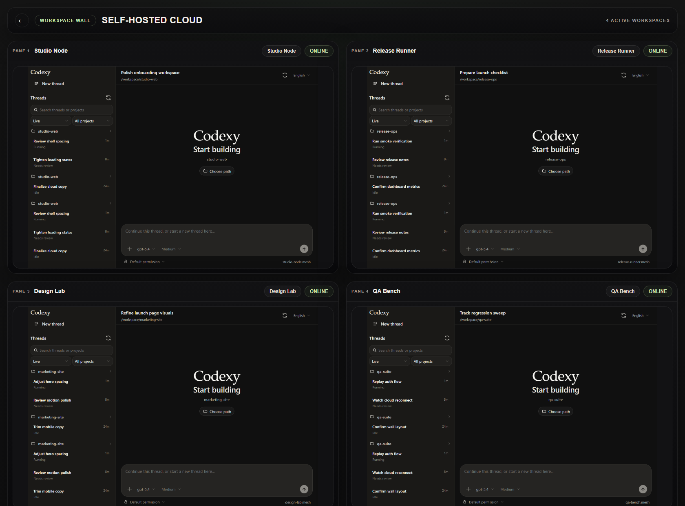

# Codexy

Codexy is a web control console for Codex workspaces. The open-source app supports two runtime modes from the same `codexy` entrypoint, so the same install can run as a local node or as a self-hosted cloud.

## Runtime Modes

### Codexy Node Mode

Use `codexy start` on a workstation or server that should run Codex locally.

- local-first workspace runtime for one host machine
- default browser address: `http://127.0.0.1:3000`
- loopback-only by default, so direct browser access stays local unless you add Tailscale or another reverse path
- can link outbound to a self-hosted Codexy cloud with `codexy link <cloud-url> --code 123456`

### Codexy Cloud Mode

Use `codexy cloud start` on a machine that should act as the self-hosted cloud entrypoint.

- single-user self-hosted control plane for linked Codexy nodes
- default browser address: `http://0.0.0.0:3400`
- protected by a Google Authenticator-compatible TOTP login
- provides the linked node directory, remote node workspaces, and the desktop-only workspace wall

## Interface Preview

<table>
  <tr>
    <td valign="top" width="68%">
      <strong>Desktop workspace</strong><br />
      
    </td>
    <td valign="top" width="32%">
      <strong>Mobile app</strong><br />
      
    </td>
  </tr>
</table>

<p>
  <strong>Cloud wall</strong><br />
  
</p>

## Requirements

- Node.js 20+
- npm 10+

## First Run

1. Run `install.cmd` on Windows or `./install.sh` on macOS/Linux.
2. Run `codexy doctor`.
3. Run `codexy start`.

Current first-run command surface:

- `codexy help`
- `codexy doctor`
- `codexy start`
- `codexy stop`
- `codexy status`
- `codexy logs`
- `codexy open`
- `codexy cloud start`
- `codexy cloud stop`
- `codexy cloud status`
- `codexy cloud logs`
- `codexy cloud open`
- `codexy link <cloud-url> [--code 123456]`
- `codexy unlink`

To start a local self-hosted cloud entrypoint:

```bash
codexy cloud start
```

To point a node at a self-hosted cloud entrypoint:

```bash
codexy link https://cloud.example.com --code 123456
```

Start the linked node with `codexy start`, then open that node from the cloud dashboard. The node keeps a cloud connector open in the background, so the browser does not need a directly reachable node address.

Cloud mode is protected by a single Google Authenticator-compatible TOTP binding. On the first cloud open, bind an authenticator in the browser. After that:

- browser access to the dashboard and remote node workspaces requires a 6-digit authenticator login
- `codexy link` also requires the current 6-digit authenticator code so node registration is not anonymous

This writes local node configuration into the active Codexy home directory, which defaults to `~/.codexy` unless `CODEXY_HOME_DIR` is set.

## Install Dependencies

```bash
npm install
```

## Entrypoints

### 1. Build

Build the production bundle:

```bash
npm run build
```

This writes the production bundle to `.next-runtime` so development runs can keep using `.next` without clobbering the live runtime.

Windows shortcut:

```bat
build.cmd
```

### 2. Development Runtime

Start the development server on port `3001` by default:

```bash
npm run dev
```

Windows shortcut:

```bat
dev.cmd
```

Shell shortcut:

```sh
./dev.sh
```

To use a custom port, pass the port directly or use `--port`:

```bat
dev.cmd 3100
dev.cmd --port 3100
```

### 3. Production Runtime

Build first, then start the production server:

```bash
npm run build
npm run start
```

Windows shortcut:

```bat
start.cmd
```

Shell shortcuts:

```sh
./build.sh
./start.sh
```

Custom ports are also supported:

```bat
start.cmd 3100
start.cmd --port 3100
```

```sh
./start.sh 3100
./start.sh --port 3100
```

## Default Port Split

- Node runtime: `3000`
- Cloud runtime: `3400`
- Development runtime: `3001`
- Direct entrypoints:
  - Windows: `build.cmd`, `dev.cmd`, `start.cmd`
  - Shell: `build.sh`, `dev.sh`, `start.sh`

## Common Verification Commands

Baseline verification:

```bash
npm run verify
```

Verification including end-to-end tests:

```bash
npm run verify:e2e
```

## Project Notes

- The web client talks to the server only through HTTP APIs and the event stream.
- The Codexy API Server connects to the Codex bridge and exposes stable browser-facing interfaces.
- Live execution and approval flows must go through the Codex protocol, not ad hoc shell wrappers.
- Engineering rules for orthogonality, simplicity, and context discipline live in [docs/engineering-governance.md](./docs/engineering-governance.md).

For detailed runtime ownership boundaries, see [agents.md](./agents.md). For product requirements, see [docs/spec.md](./docs/spec.md). For the normative UI contract, see [docs/visual-spec.md](./docs/visual-spec.md).
